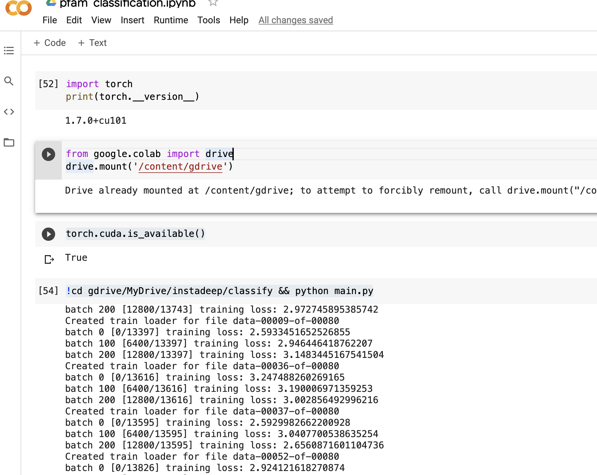

# InstaDeep Pfam Classification

The technical test comes from kaggle, [here](https://www.kaggle.com/googleai/pfam-seed-random-split).
Given a protein sequence, once must classify it to a certain class.

## Clone repository
On top of the clone you will need to download an extra 1-2GB (pretrained model and data preparation)
To clone repository : 
```sh
$ git clone git@github.com:thibmonsel/PfamClassification.git
$ cd PfamClassification
```

## Download Kaggle Data

Unfortunately there is no API available to download the protein data or I couldn't find it !
You must manually download the data from [here](https://www.kaggle.com/googleai/pfam-seed-random-split)
The data must be placed in the root directory of the repository.

## Download weights of pre-trained model

You must download the pre-trained model by asking access to download from google drive [here](https://drive.google.com/file/d/1rKblIFJGTqxMSnX_kYpHk1DZ7RhrwD31/view?usp=sharing).
Please put download file `network.pth` in path `root/classify/`.
## Environment setup 
Please run : 
```sh
$ conda env create --name envname --file environment.yml
```

## Repository structure check 

Your folder should look like this :

```sh
├── README.md
├── classify
│   ├── data_preparation.py
│   ├── label_encoder.p
│   ├── main.py
│   ├── network.pth
│   └── network.py
├── data_analysis
│   ├── data_analysis.ipynb
│   └── your_report.html
├── environment.yml
├── random_split
│   ├── dev
│   ├── test
│   └── train
├── static
│   ├── evaluating.png
│   └── training.png
├── raw_train.csv
└── utils.py
```

The file `raw_train.csv` is computed is the section 1/Data Analysis below.
## Repository architecture

- In the root directory we have a `utils.py` file where are located helper functions and a `environment.yml` file for virtual environment setup.
- In the **data_analysis** directory :
    * `data_analysis.ipynb` notebook that summarizes general information on the dataset.
    * `your_report.html` is an Panda Profiler of the test data.
- In **the classify** directory :
    * `data_preparation.py` contains the `DataPreparation` class that helps encode **family_accession** and protein sequences.
    * `label_encoder.p` is a pickled file that stores the **family_accession** encoder generated with the training data. 
    * `network.py` is the deep learning model. The model is comprised of Bilstm and Conv2d layers.
    * `main.py` is the main file that is used to train and evaluate the Deep Learning model.
    * `network.pth` is the saved pre-trained deep learning model_state. It is used to load the model's parameter.
- In the **static** directory is static content for display.


## Navigate through the repository

### 1/ Data Analysis

If in the root directory there is no `raw_train.csv`, please uncomment the **second cell in the notebook** in order to create csv file.

If you want to open the data profiler through **terminal**.
```sh
$ cd data_analysis
$ open("your_report.html")
```

### 2/ Classifying

Please make sure that `raw_train.csv` exist and is in the root directory.
The model has `200,250,086` parameters and needs GPU for training.

#### Training
I do not recommend training it on a cpu...
Use Google Colab in order to train my model and used a GPU executor.
Upload the repository on **Google Drive**
Create a Google Colab, that has the 4 following cells :
```sh
import torch
print(torch.__version__)
>>> 1.7.0+cu101
```
```sh
from google.colab import drive
drive.mount('/content/gdrive')
```
You will have to authenticate with your gmail account.
```sh
torch.cuda.is_available()
>>> True
```
```sh
!cd gdrive/MyDrive/PfamClassification/classify && python main.py
```
At the end of the execution : the model parameters will be saved in `network.pth`.
Below are photo snippets of how the training should look like.




Model's testing accuracy is `65.39%`. No **f1 score** with recall and precision was computed here since there are too many classes.

#### Evaluating protein sequence family accession
The file `main_prediction.py` enables the user to predict family accession of one protein with a CLI.
Please run :
```sh
python main_prediction.py --sequence="AGVPCSVKASEGYLFPLDRCFLFVTKPTLYIPYSEISSVVMSRTGGGVSASRTFDLEVNVIGSNQPHVFSNIDREEQEFIESFCKEKGVKVKN"
>>> For the sequence AGVPCSVKASEGYLFPLDRCFLFVTKPTLYIPYSEISSVVMSRTGGGVSASRTFDLEVNVIGSNQPHVFSNIDREEQEFIESFCKEKGVKVKN we predict that its family accession is PF14944.6.
```

# Thought Process for this challenge

With the large amount of data, the easiest way to have a fast summary of the data was to merge all of the test data in one csv file and then do a panda profiler.  Thanks to that I was able to see how big was the dataset (`1,000,000` datapoint) and roughly `18,000` classes.

Since both of the input (sequence) and output (family_accession) were **categorical**, encoding and possible embedding was necessary in order to feed it to  a DL model.

For the protein sequence :
- Mapped each amino acids (24 of them) to one unique integer. ('A' maps to 1)
- Thanks to the panda profiler the max length of one protein in the testset was roughly `21000`. So I choose a fixed sequence-length of `22000` and did some zero padding. 


For the family_accession : 
- Used a labelEncoder to map each label to one unique integer.
- Had to manually deal with the possibility of having unseen labels in the test data. 

I chose to do a Deep Learning model with the Pytorch framework.

In order to get a meaningful representation of the sequence I started out with an `Embedding` layer. I chose to have some `Conv2d` and `LSTM` layers. Having both layers seemed to be important because convolutions would extract high level features of the sequence and the lstm one would take long-term dependencies.
After those layer, I flattened out the tensor and passed it through a fully connected network.

Note : 
For better performance, one might need to curate the dataset.


